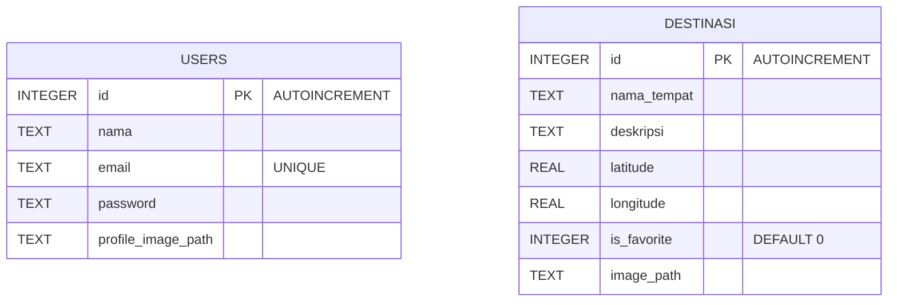
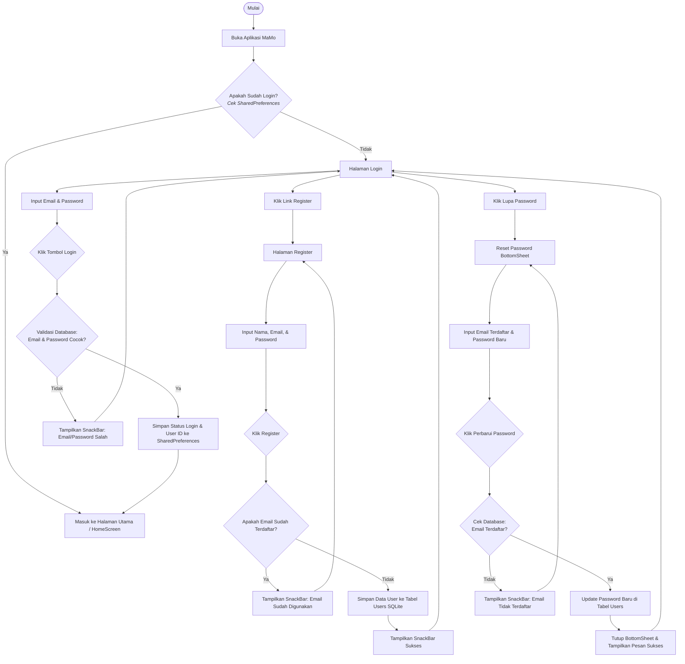
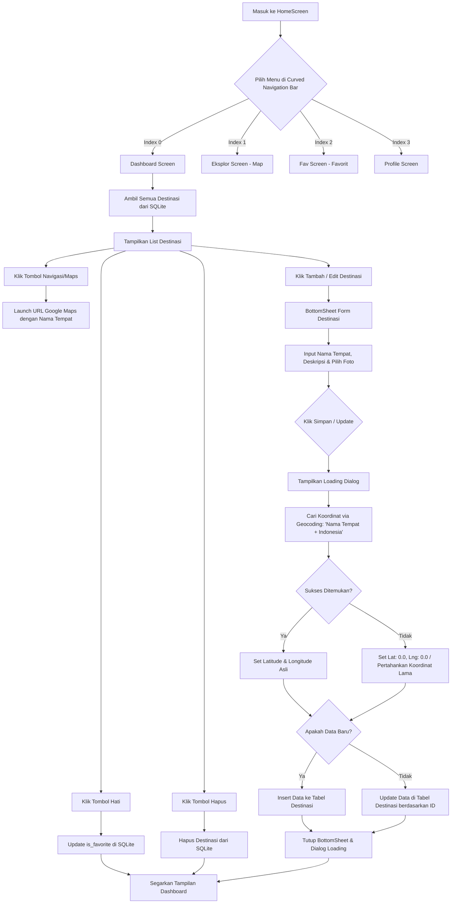
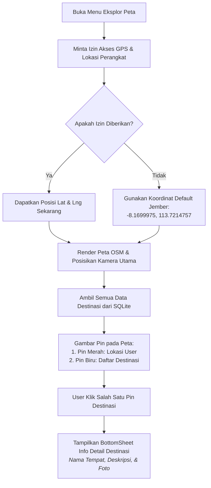
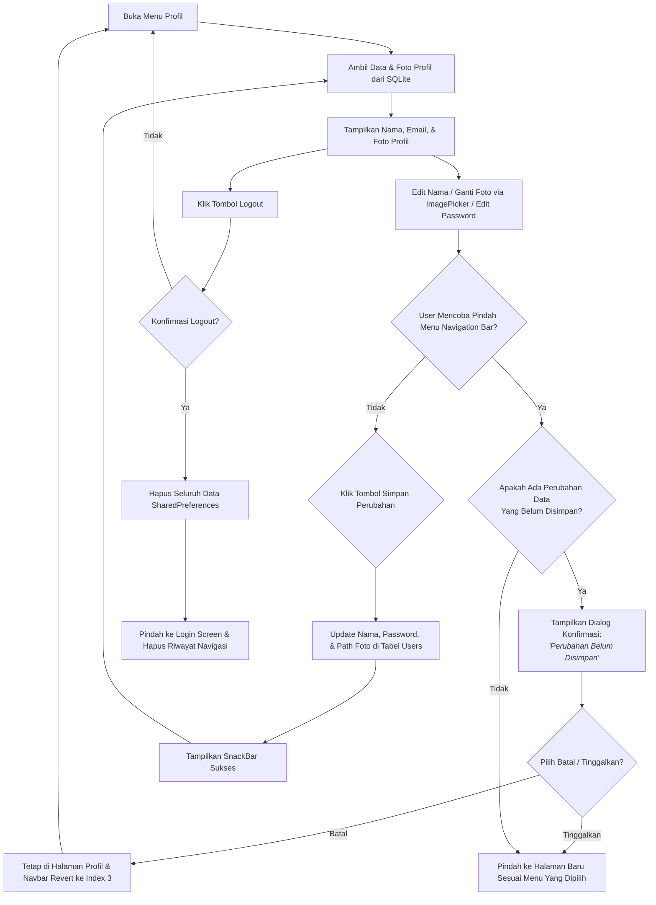

# Dokumen Arsitektur: ERD & Flowchart MaMo (Map Mobile Explorer)

Dokumen ini berisi penjelasan dan representasi visual dari **Entity Relationship Diagram (ERD)** serta **Flowchart** dari alur kerja utama aplikasi **MaMo**. 

---

## 1. Entity Relationship Diagram (ERD)

Aplikasi **MaMo** menggunakan **SQLite** (melalui package `sqflite`) sebagai penyimpanan lokal dengan database bernama `ujikom_mobile.db`. Terdapat 2 tabel utama dalam database ini:
1. **`users`**: Menyimpan data akun pengguna untuk keperluan registrasi, login, dan profil.
2. **`destinasi`**: Menyimpan data destinasi/lokasi tujuan yang ditambahkan oleh user, termasuk koordinat (latitude & longitude) untuk integrasi peta, serta status favorit.

Berikut adalah diagram relasi entitasnya (ERD). 

> [!NOTE]
> Karena aplikasi ini berjalan sepenuhnya lokal di satu perangkat, data destinasi bersifat global per perangkat dan tidak dibatasi secara spesifik per-user (tidak menggunakan relasi foreign key eksplisit di SQLite). Namun, aplikasi secara logis membagi data ini untuk fungsionalitas pengguna.

### Penjelasan Detail Field Tabel

#### Tabel `users`
* **`id` (INTEGER, PK)**: Identifier unik untuk setiap user (auto increment).
* **`nama` (TEXT)**: Nama lengkap pengguna.
* **`email` (TEXT, UNIQUE)**: Alamat email pengguna untuk login (tidak boleh kembar).
* **`password` (TEXT)**: Sandi keamanan akun pengguna.
* **`profile_image_path` (TEXT)**: Lokasi path gambar profil di direktori penyimpanan lokal HP.

#### Tabel `destinasi`
* **`id` (INTEGER, PK)**: Identifier unik untuk setiap destinasi (auto increment).
* **`nama_tempat` (TEXT)**: Nama tempat atau alamat lokasi destinasi.
* **`deskripsi` (TEXT)**: Keterangan tambahan atau catatan mengenai lokasi tersebut.
* **`latitude` (REAL)**: Koordinat lintang lokasi (didapatkan secara otomatis melalui geocoding alamat).
* **`longitude` (REAL)**: Koordinat bujur lokasi (didapatkan secara otomatis melalui geocoding alamat).
* **`is_favorite` (INTEGER)**: Status favorit tempat (`1` = Favorit, `0` = Biasa).
* **`image_path` (TEXT)**: Lokasi path gambar destinasi di direktori lokal HP.

---

## 2. Flowchart Alur Kerja Utama

Berikut adalah diagram alur logika pemrograman aplikasi MaMo yang dibagi berdasarkan modul fitur utama.

### A. Alur Registrasi, Login, dan Lupa Password
Flowchart ini menjelaskan proses dari aplikasi pertama kali dibuka, pengecekan session login pengguna, registrasi akun baru, hingga mekanisme reset password jika lupa.

---

### B. Alur Utama Navigasi (HomeScreen) & CRUD Destinasi
Flowchart ini memetakan menu navigasi utama (Dashboard, Peta Eksplorasi, Favorit, Profil) dan proses lengkap manajemen data destinasi (Create, Read, Update, Delete) yang diintegrasikan dengan Geocoding alamat.

---

### C. Alur Eksplorasi Peta (Explore Screen)
Flowchart ini menjelaskan bagaimana data koordinat destinasi yang tersimpan di SQLite dipetakan menggunakan `flutter_map` (OpenStreetMap) bersamaan dengan posisi GPS real-time pengguna.

---

### D. Alur Profil & Manajemen Perubahan
Flowchart ini mengilustrasikan proses edit profil pengguna, penggantian foto profil, dan validasi penting sebelum pengguna meninggalkan halaman profil jika ada data yang belum disimpan.

